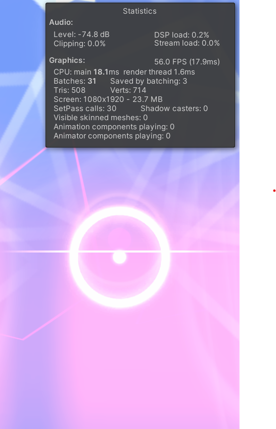
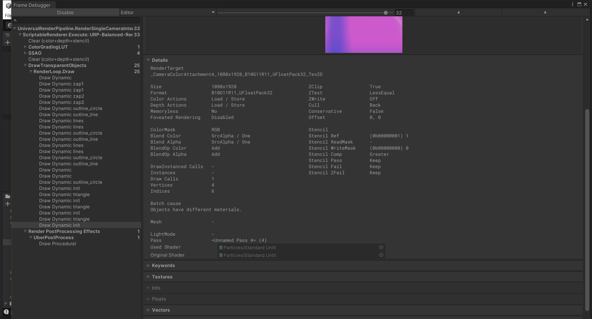
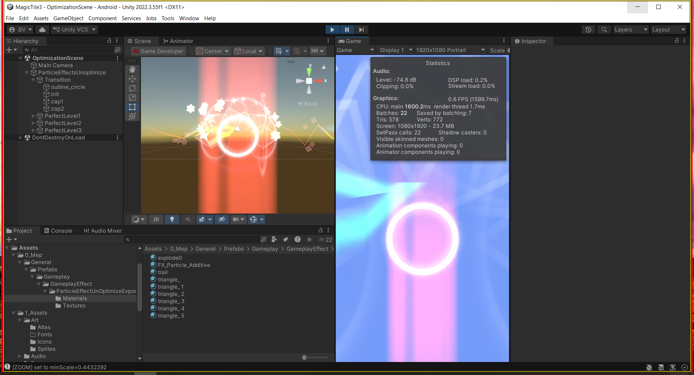
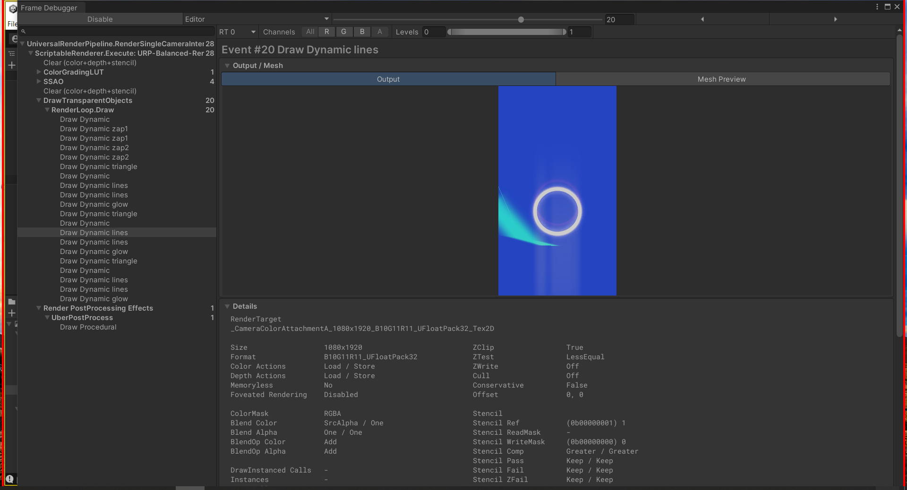

# OPTIMIZATION.md — Task 2: UI/VFX Optimization Challenge

Unity 2022.3.55f1 · URP 14.0.11 · Android  
Package: `UnOptimized.unitypackage`  
Date: 2026-08-12

---

## Before: Profiling Screenshot Showing Initial Draw Calls

Imported the package into a clean URP project and opened `OptimizationScene.unity`. Hit Play, checked the Stats overlay.

Batches: **31**. SetPass calls: **30**. Saved by batching: 3. Tris 596, verts 798.

For a single VFX prefab with ~80 particles on screen, 31 batches is way too high. I opened the Frame Debugger and found 25 draw events, all with the same reason:

```
Batch cause:  Objects have different materials
Used Shader:  Particles/Standard Unlit
```

I didn't screenshot at random because batch counts jump every frame as particles spawn and die. I swept `Simulate(t)` from 0.05s to 2.0s to find the worst moment: **t = 0.30s**, all 26 enabled systems alive, 87 particles total. Froze there. Both Before and After use that exact same frozen point.





---

## Issues Found

Walked through every draw event in the Frame Debugger and cross-referenced with the prefab YAML.

- **Eight materials for one effect.** They all use the same shader and only differ in which texture they point at. Someone duplicated the material 8 times instead of reusing one and swapping the texture. I had to count them twice because I didn't believe it.

- **Built-in RP shaders in a URP project.** `Mobile/Particles/Additive` and `Particles/Standard Unlit` are not URP shaders. The second one even drags a GrabPass and distortion path that URP doesn't implement.

- **Dynamic batching off** in all three URP assets. Particle renderers rebuild geometry every frame so the SRP Batcher can't touch them — dynamic batching is the only merge path they have. It was probably off because the project template had it disabled and nobody checked.

- **Sorting order split across 1, 9 and 11.** `outline_circle` appears four times on one material: three at order 9 and one at order 11. They can't sit next to each other in the draw list. The blend is additive so the order doesn't even matter visually.

- **`zap2` has a mirrored transform** `(-1.3, 1.3, 1)`. The negative scale flips winding, Unity flips cull mode, and a batch can only carry one cull mode. `zap1` is identical otherwise, so two visually identical objects draw in separate batches because one is flipped. I missed this the first time I looked.

- **All three tiers active at once** when gameplay only ever plays one. The prefab has 30 systems but only ~8 matter at any moment.

- **`maxParticles: 1000`** on 24 of 30 systems. Actual peak was 7.

- **Four container objects** with ParticleSystem components they never use.

- **Motion vectors enabled** on transparent particles. Also one material that nothing references.

- **SSAO running** on a scene of unlit 2D particles that don't write depth. I found this by accident while reading the Frame Debugger tree.

---

## Changes Made

### Fix 1 — Enable Dynamic Batching
Toggled dynamic batching on in the Base URP Asset, Balanced, and High Fidelity quality assets. URP 14 hides this field — you need Inspector Debug mode to reach it.

Result: 31 batches, 30 SetPass. No change.

I did this first thinking it would be the big win. It wasn't. But it's a prerequisite — the draws still had 8 materials, three sorting orders, and a mirrored transform blocking them. Those four fixes only work together. The fact that dynamic batching alone did nothing actually proved the other problems were the real blockers.

### Fix 2 — Convert All Shaders to URP
Converted all materials to `Universal Render Pipeline/Particles/Unlit`, Transparent + Additive, with soft particles, camera fading, and distortion off.

Result: still 31 batches. Every particle draw still said `SRP: Node is not compatible with SRP batcher`. This was a correctness fix, not a draw call fix.

I thought swapping to a URP shader would make particle draws SRP Batcher compatible. It doesn't — the incompatibility is in the renderer, not the shader. Swapping shaders also keeps old serialized properties. A leftover HDR emission color turned the whole effect white until I found it. `_MainTex` → `_BaseMap` also silently dropped the texture reference on one material.

### Fix 3 — One Atlas, One Material
Packed 7 textures into a Sprite Atlas `FX_Particles` (512×256, ASTC 6×6). Created a single shared material `FX_Particle_Additive`. Pointed 23 of the 26 enabled renderers at it. Each system gets its own image through Texture Sheet Animation in Sprites mode, which remaps UVs into the atlas rect.

I checked that every material had tiling `(1,1)` first — textures that tile can't be atlased because UVs outside [0,1] bleed into neighbors. I actually built the atlas first and only checked tiling after one sprite looked wrong. Should have done it the other way around.

Two things couldn't join the atlas:
- Three `triangle` systems use a 4×6 flipbook. Grid mode divides the material's texture, so an atlas breaks the grid.
- Five trail renderers don't support TSA UV remapping at all.

They keep their own materials. I tried for a while to get the trails into the atlas before giving up.

### Fix 4 — Unify Sorting Order & Fix Mirrored Transform
Set sorting order to **0** everywhere. Changed `zap2` back to positive scale and used `Renderer → Flip → X` instead. That flips at geometry generation without changing the determinant, so batching works. `Flip → X` was right there in the inspector the whole time.

### Fix 5 — Cleanup Pass
- `maxParticles` 1000 → **32**
- Removed the four unused container ParticleSystems
- Motion vectors set to **Camera only**
- Deleted the unreferenced material
- Turned **SSAO off** on Balanced and High Fidelity renderers

---

## After: Profiling Screenshot Showing Final Draw Calls

Same frozen point, same 26 systems, same 87 particles.

| Metric | Before | After |
|--------|--------|-------|
| Batches | 31 | **22** |
| SetPass calls | 30 | **22** |
| Saved by batching | 3 | 7 |
| Draw events under DrawTransparentObjects | 25 | **20** |
| Materials on the effect | 8 | 3 |
| Textures shipped | 8 loose | 1 atlas + 1 loose |





22 batches. Not as good as I wanted — I predicted 15. The flipbook and trails couldn't use the atlas, and writing the prediction down beforehand is what made me notice them. Without that note I probably would have stopped at 22.

**Runtime scenario** (one tier + Transition active, which is what actually happens): **12 batches and 12 SetPass calls**. That's the number that matters.

---

## Putting It in the Game

The effect only lived in a test scene, so I wired it into `GameScene`.

**Milestones first.** `MilestoneVfxView` listens to `ComboChanged` and plays the tier matching `ScoreModel.Milestones` — one tier plus Transition, the 12-batch case above. Scale 0.15 on the root, measured rather than guessed: at 0.25 the effect spans 14.2 world units against a camera that sees 5.6 × 10, and it washes the screen out. The hit line's height is computed from the camera at runtime, so the view snaps to it instead of trusting a value from the scene file.

**Per-note, which is the more interesting case.** A Perfect fires up to 183 times a song against 3 milestones, and the chart runs a note every 0.47s while the effect lasts about a second — play the group and two copies overlap permanently. So `PerfectHitVfxView` keeps one system alive with emission rate 0 and calls `Emit()` at `HitResult.WorldPosition`. Emit appends to the existing particle buffer instead of restarting anything, and one system draws all its live particles in a single call. Eight overlapping hits still cost **one draw call** where playing the group would cost twelve times the overlap.

`rain4` is the system I reused: of the small ones it's the only one already on the atlas material with no trail renderer. The trails and the flipbook would each have brought a second material back in.

---

## Learnings: Brief Reflection on What I Learned

The Frame Debugger only reports the first thing blocking a batch. Everything behind it stays hidden until you fix that one. I had to re-check the batch cause after every change. There is no shortcut.

I was wrong about the SRP Batcher. A URP shader does not make particle draws compatible — the incompatibility is in the renderer, not the shader.

31 to 22 is a decent drop but not huge. The real problem is that draw calls weren't even the bottleneck here. 87 particles and 578 triangles is nothing. The effect is fill-rate bound, with twenty-odd additive layers over most of the screen and some systems using Start Size 40 against a camera that sees 10. Cutting draw calls was the assignment requirement, but on a real device I would go after overdraw first.

Reusing an authored particle system means inheriting its curves. `rain4` has Size and Color over Lifetime tuned for its original 0.4s life, both starting near zero. Every value I set on the new one had to account for that: Start Size 0.9 lands at roughly 0.3 world units on screen, because the curve scales it down to about a third at its peak.

The bug that cost me the most time wasn't in the effect. `Run In Background` is off, so the Editor freezes the moment it loses focus — the frame counter sat at 2 across six seconds. Every runtime number and every Game view capture I took while alt-tabbed was a stale frame from before. I read those as "the effect isn't rendering" and chased sorting order and render depth for a while. The lesson is cheap and general: before trusting a runtime measurement, check that time is actually advancing.

One thing I should have done earlier: check texture import settings before profiling. The 512×512 uncompressed RGBA32 sprite was an obvious red flag that I only noticed half an hour in.

---

## AI Usage (Optional)

**Tool:** Claude Code, with the Unity MCP plugin driving the Editor.

**What AI did:**
- Wrote the freeze method (`Simulate(t)` sweep)
- Read counters through `UnityEditor.UnityStats`
- Drove the Frame Debugger through its internal API
- Took the screenshots
- Parsed the 146k-line prefab YAML into the renderer → material → sorting-order table that found the `outline_circle` split and the `zap1`/`zap2` pair

**What I did by hand:**
- Sprite Atlas setup: texture import settings, atlas asset, packing options, Sprite Packer mode, and enabling Dynamic Batching on the three URP assets

**What AI did that I verified:**
- Shader conversion
- Material and Texture Sheet Animation assignment across 23 renderers
- Cleanup pass

**Game integration — AI, on my brief.** I decided it should hook the Perfect judgement at the hit line and keep the milestone effect; AI wrote both views, wired the scene, and worked out the note-rate arithmetic behind `Emit()` over `Play()`.

**This document:** AI drafted, I edited.

**Three times AI was wrong:**
1. It read `_SrcBlend`/`_DstBlend` from the YAML and said all eight materials shared a blend state. Those fields are stale leftovers on `Mobile/Particles/Additive`, which hardcodes its blend.
2. It pointed me at a Scene view Overdraw draw mode that URP removes.
3. It justified keeping the spark system looping by claiming `Emit()` needs a playing system — the test it then ran showed Emit works stopped, playing, or past duration.

Verify everything. AI is fast but it doesn't know your project.
